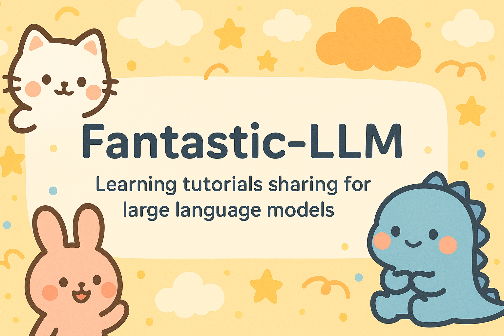

# FantasticLLM

面向大型语言模型（LLM）的系统化学习与实战笔记。内容覆盖 Transformer 基础、分词与嵌入、位置编码、激活与归一化、优化方法、参数高效微调（PEFT）、主流模型对比与模型评估，配套配图与示例，便于上手与复习。

> 适合对象：正在系统入门/进阶 LLM 的工程师与学生。

## 内容一览（与目录同步）

- 01：Transformer 论文精读与扩展
  - 论文精读：《Attention Is All You Need》
    - 文档：[`docs/01 Transformer/01 Transformer Attention Is All You Need.md`](docs/01%20Transformer/01%20Transformer%20Attention%20Is%20All%20You%20Need.md)
  - 扩展：BERT 家族
    - 文档：[`docs/01 Transformer/02 Bert.md`](docs/01%20Transformer/02%20Bert.md)

- 02：分词器（Tokenizer）原理与实践
  - 文档：[`docs/02 Tokenizer/02 Tokenizer.md`](docs/02%20Tokenizer/02%20Tokenizer.md)

- 03：Embedding（词/句向量）
  - 文档：[`docs/03 Embedding/03 Embedding.md`](docs/03%20Embedding/03%20Embedding.md)

- 04：位置编码（Positional Embedding）
  - 文档：[`docs/04 Positional Embedding/04 Positional Embedding.md`](docs/04%20Positional%20Embedding/04%20Positional%20Embedding.md)

- 05：激活函数与归一化（Activations & Normalizations）
  - 文档：[`docs/05 Activations and Normalizations/05 Activations and Normalizations.md`](docs/05%20Activations%20and%20Normalizations/05%20Activations%20and%20Normalizations.md)

- 06：优化方法（Optimizations）
  - 文档：[`docs/06 Optimizations/06 Optimizations.md`](docs/06%20Optimizations/06%20Optimizations.md)

- 07：LLM 指令微调（Fine-tuning）与参数高效微调（PEFT）
  - 总览：[`docs/07 LLM Fine tuning/07 LLM Fine tuning.md`](docs/07%20LLM%20Fine%20tuning/07%20LLM%20Fine%20tuning.md)
  - LoRA：[`docs/07 LLM Fine tuning/LoRA.md`](docs/07%20LLM%20Fine%20tuning/LoRA.md)
  - Prefix-Tuning：[`docs/07 LLM Fine tuning/Prefix-Tuning.md`](docs/07%20LLM%20Fine%20tuning/Prefix-Tuning.md)
  - 模型微调实战
    - Qwen2-Medical-SFT：[`docs/07 LLM Fine tuning/模型微调实战/Qwen2-Medical-SFT/`](docs/07%20LLM%20Fine%20tuning/模型微调实战/Qwen2-Medical-SFT/)

- 08：主流模型对比
  - 总览：[`docs/08 主流模型/01 主流模型对比.md`](docs/08%20主流模型/01%20主流模型对比.md)
  - GPT系列：[`docs/08 主流模型/02 GPT系列.md`](docs/08%20主流模型/02%20GPT系列.md)
  - Llama系列：[`docs/08 主流模型/03 Llama系列.md`](docs/08%20主流模型/03%20Llama系列.md)
  - Deepseek系列：[`docs/08 主流模型/04 Deepseek系列.md`](docs/08%20主流模型/04%20Deepseek系列.md)
  - Qwen系列：[`docs/08 主流模型/05 Qwen系列.md`](docs/08%20主流模型/05%20Qwen系列.md)
  - 研究报告：[`docs/08 主流模型/研究报告/`](docs/08%20主流模型/研究报告/)

- 09：模型评估（Ragas/Deepeval 等思路与指标）
  - 文档：[`docs/09 模型评估/Evaluate.md`](docs/09%20模型评估/Evaluate.md)

- 10：模型部署
  - 文档：[`docs/10 模型部署/模型部署.md`](docs/10%20模型部署/模型部署.md)

- 11：模型训练
  - 目录：[`docs/11 模型训练/`](docs/11%20模型训练/)（待完善）

- 15：开源项目
  - 文档：[`docs/15 开源项目/temp.md`](docs/15%20开源项目/temp.md)

- 18：面试题整理
  - Part 1：[`docs/18 面试题/part1.md`](docs/18%20面试题/part1.md)

- 20：数据集
  - 文档：[`docs/20 数据集/dataset.md`](docs/20%20数据集/dataset.md)

提示：含有配图的章节在对应目录下提供图片资源，Markdown 中已使用相对路径引用，可直接在本地或 Git 平台预览。

## 推荐阅读顺序

1) 01 Transformer → 02 Tokenizer → 03/04 Embedding 与 Position 夯实基础
2) 05 激活/归一化 → 06 优化方法 完成训练细节
3) 07 微调与 PEFT → 08 主流模型对比 形成体系
4) 09 模型评估 → 10 模型部署 → 11 模型训练 实践应用
5) 18 面试题 → 20 数据集 回顾与查漏补缺

## 如何查看文档

- 本地快速预览：直接打开 `docs/index.html` 或 `docs/index.md`。
- Markdown 阅读：使用 VS Code、Obsidian 或任意 Markdown 阅读器均可。
- 渲染建议：如需更佳体验，安装 VS Code 扩展（Markdown Preview Enhanced、Mermaid 等）。

## 贡献指南

- 欢迎修正错别字、补充示例、完善推导或加入参考链接。
- 请保持文件命名与目录结构一致；配图放在对应章节的 `images/` 或同级目录中。
- 建议在段落末尾附参考文献或链接，便于长期维护。

## 许可

若仓库根目录未另行声明许可协议，则默认保留所有权利。提交贡献视为同意以本仓库同等许可共享。

## 致谢

- Transformer: Attention Is All You Need
- 以及社区中对 LLM 生态的优秀开源资料与实践分享
