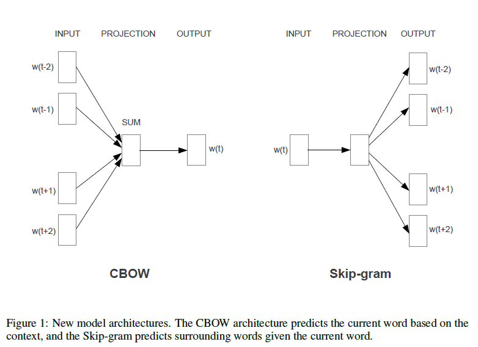

# 03. Embedding

[Embedding Leaderboard](https://huggingface.co/spaces/mteb/leaderboard)

## 1. 简介

Embedding是一种向量化（Vectorization）的技术，是指将文本（或其他类型的输入）转化为数值向量的过程，这些数值向量能够被机器学习模型或深度学习网络理解和处理。在自然语言处理中，有三种类型的Embedding最基础且常用，分别是**Token Embedding**、**Sentence Embedding/Paragraph Embedding** 和**Positional Embedding**。它们各自承担不同的角色：

1. **Token Embedding**

- **作用**：将输入文本中的**每个token**转换为一个固定维度的稠密向量，是模型输入的基础表示。
- **目的**：让模型能“理解”离散的符号（如 "cat"、"##ing"），将其表示为可计算的数值形式。
- **示例**：
  句子 `"I love NLP"` → 分词为 `["I", "love", "NLP"]` → 每个词映射为一个向量（如 768 维），最终形成$3*768$维的矩阵。

2. **Sentence Embedding / Paragraph Embedding（句子/段落嵌入）**

- **作用**：将**整个句子或段落**压缩成一个**单一的向量**，用于表示其整体语义。
- **目的**：支持句子级别的任务，如文本分类、语义相似度计算、聚类、检索等。
- **如何获得**：
  - 对所有 token embeddings 做平均（Mean Pooling）；
  - 使用特殊标记（如 BERT 中的 `[CLS]`）的输出；
  - 使用专用模型（如 Sentence-BERT）。
- **示例**： 
  `"I love NLP"` → 一个 768 维的向量，代表整句话的含义。

3. **Positional Embedding（位置嵌入）**

- **作用**：为模型提供**Token在序列中的位置信息**。
- **为什么需要**：像 Transformer 这样的模型本身没有“顺序”概念（它并行处理所有 token），必须显式加入位置信息才能理解“谁在前、谁在后”。
- **实现方式**：
  - **固定编码**：使用正弦和余弦函数（原始 Transformer）；
  - **可学习向量**：每个位置对应一个可训练的向量（如 BERT）。

> 一句话总结三者关系：**Token Embedding 告诉模型“这是什么词”，Positional Embedding 告诉模型“这个词在哪儿”，Sentence Embedding 告诉模型“整句话是什么意思”。**

这三种 embedding 通常**协同工作**，尤其是在 Transformer 架构中，共同构成模型理解语言的基础。本文主要讲解Token Embedding技术。

## 2. Token Embedding 工作原理

​	要了解词嵌入的的工作原理，首先要知道**嵌入矩阵**。嵌入矩阵(Embedding Matrix)是词嵌入的核心组件，用于将词表ID 映射到高维的稠密向量表示。它可以理解为一个大表格，里面存储了模型词汇表中每个Token的向量表示。在向量化的过程中，模型通过词表ID在嵌入矩阵中查找相应的向量，来实现从离散的词ID到连续向量空间的转换。

​	嵌入矩阵的维度通常是$V×D$，其中$V$是模型词汇表(vocabulary)的大小，即模型所能识别的所有词或子词的数量；$D$是每个词向量的维度，通常是一个较大的数字(比如512维、1024维等)，这取决于具体模型的设计。

​	在嵌入矩阵中：每一行对应一个词表中的词ID，这一行存储的句量就是这个词ID对应的高维向量表示。

​	例：假设词汇表大小为V=100000，词向量维度D=512，那么嵌入矩阵的大小就是10000×512，每一个词表中的词都有一个512维的向量表示。嵌入矩阵的部分内容看起来就是这样:

| 词表 ID | 词向量                         | 对应 token |
| ------- | ------------------------------ | ---------- |
| 102     | `[0.1, 0.2, -0.3, ..., 0.6]`   | `I`        |
| 400     | `[0.02, 0.3, -0.1, ..., 0.1]`  | `N`        |
| 1501    | `[0.4, 0.5, -0.2, ..., 0.7]`   | `##LP`     |
| 2034    | `[0.05, -0.12, 0.3, ..., 0.4]` | `love`     |
| ...     | ...                            | ...        |

 即有以下的映射:
`I` (词表ID:102)  → 嵌入向量 [0.1, 0.2, -0.3, -0.3, ..6]
`love` (词表ID:2034)  → 嵌入向量[0.05, -0.12, 0.3, ..., 0.4]
在训练或推理过程中，当输入经过Token化并转化为词表ID序列后，嵌入层会利用这些ID在嵌入矩阵中查找相应的词向量，这是通过查找
机制完成的。模型会将这些向量作为输入，送入神经网络的后续层进行处理。

Token Embedding主要有两种类型：静态Embedding和动态Embedding。静态向量指的是一旦训练完成后，对应的向量便不再发生改变，比如一个词经过向量化之后，在后续的场景中该词对应的向量不会发生改变，这些方法主要包括Word2Vec、GloVe和FastText。而动态向量方法生成的嵌入，是基于上下文的动态向量，同一个词在不同的上下文中可能有不同的向量表示，从而更精准地捕捉语言中的多义性和语境变化，代表方法有ELMO、GPT和BERT等。

## **3. 词袋模型（Bag of Words, BoW）**

**词袋模型**是最简单且经典的文本向量化方法之一，它将文本表示为词频的向量，不考虑单词的顺序，仅仅统计每个单词出现的频次。

**步骤**：

​	• 创建一个词汇表，包含所有文档中出现的词。

​	• 对每个文档，统计词汇表中每个词出现的次数，得到一个向量表示。

**优缺点**：

​	• **优点**：简单易实现，适用于文本分类等任务。

​	• **缺点**：无法捕捉单词的语法和语义信息，且向量维度较高，存在稀疏性问题。

**应用**：常用于文本分类、情感分析等任务。

```python
from sklearn.feature_extraction.text import CountVectorizer

# 示例文本
documents = [
    "I love deep learning",
    "I love machine learning and NLP",
    "Deep learning is amazing"
]

# 初始化 BoW 模型
vectorizer = CountVectorizer()
bow_matrix = vectorizer.fit_transform(documents)

# 输出 BoW 词汇表
print("词汇表:", vectorizer.get_feature_names_out())

# 输出 BoW 特征矩阵
print("BoW 矩阵:\n", bow_matrix.toarray())
```

```python
import numpy as np

def bow_transform(documents):
    # 构建词汇表
    vocabulary = list(set(word for doc in documents for word in doc.split()))
    word_index = {word: i for i, word in enumerate(vocabulary)}

    # 初始化 BoW 矩阵
    bow_matrix = np.zeros((len(documents), len(vocabulary)), dtype=int)

    # 填充 BoW 矩阵
    for i, doc in enumerate(documents):
        for word in doc.split():
            if word in word_index:
                bow_matrix[i, word_index[word]] += 1

    return vocabulary, bow_matrix

# 示例文本
documents = [
    "I love deep learning",
    "I love machine learning and NLP",
    "Deep learning is amazing"
]

# 计算 BoW
vocabulary, bow_matrix = bow_transform(documents)

# 输出词汇表和 BoW 矩阵
print("词汇表:", vocabulary)
print("BoW 矩阵:\n", bow_matrix)
```

## **4. TF-IDF（Term Frequency-Inverse Document Frequency）**

**TF-IDF**是对词袋模型的一种改进，考虑了词频和逆文档频率的加权方法。它不仅统计每个词的出现频率，还考虑词在整个语料库中的分布情况，从而降低常见词的权重，提高具有辨别性的稀有词的权重。

**公式**：

​	• **TF**（词频）表示词在单个文档中出现的频率。

​	• **IDF**（逆文档频率）表示词在整个文档集合中的重要性，常见的词权重低，稀有词权重大。

​	• **TF-IDF** = **TF** * **IDF**

**优缺点**：

​	• **优点**：相较于BoW，能够减少常见词的影响，强调重要的词汇。

​	• **缺点**：词汇长度和稀疏性问题依然存在，且无法捕捉单词之间的语义关系。

**应用**：广泛用于信息检索、文本分类等领域。

```python
from sklearn.feature_extraction.text import TfidfVectorizer

# 示例文本
documents = [
    "I love deep learning",
    "I love machine learning and NLP",
    "Deep learning is amazing"
]

# 初始化 TF-IDF 向量化器
vectorizer = TfidfVectorizer()
tfidf_matrix = vectorizer.fit_transform(documents)

# 输出词汇表
print("词汇表:", vectorizer.get_feature_names_out())

# 输出 TF-IDF 矩阵
print("TF-IDF 矩阵:\n", tfidf_matrix.toarray())
```

```python
import numpy as np
import math

def compute_tf(doc):
    """计算 TF 词频"""
    words = doc.split()
    tf_dict = {}
    for word in words:
        tf_dict[word] = tf_dict.get(word, 0) + 1
    total_words = len(words)
    return {word: count / total_words for word, count in tf_dict.items()}

def compute_idf(docs):
    """计算 IDF 逆文档频率"""
    N = len(docs)
    word_doc_freq = {}
    for doc in docs:
        for word in set(doc.split()):
            word_doc_freq[word] = word_doc_freq.get(word, 0) + 1
    return {word: math.log((N + 1) / (freq + 1)) + 1 for word, freq in word_doc_freq.items()}

def compute_tfidf(docs):
    """计算 TF-IDF"""
    tf_list = [compute_tf(doc) for doc in docs]
    idf_dict = compute_idf(docs)
    
    tfidf_matrix = []
    for tf in tf_list:
        tfidf_matrix.append({word: tf_val * idf_dict[word] for word, tf_val in tf.items()})
    
    return tfidf_matrix

# 示例文档
documents = [
    "I love deep learning",
    "I love machine learning and NLP",
    "Deep learning is amazing"
]

# 计算 TF-IDF
tfidf_matrix = compute_tfidf(documents)

# 输出
print("TF-IDF 结果：")
for i, doc in enumerate(tfidf_matrix):
    print(f"文档 {i+1}: {doc}")
```

## **5. Word2Vec（词向量）**

​	Word2Vec是Google在2013年推出的一个NLP工具，它的特点是能够将单词转化为向量来表示，这样词与词之间就可以定量的去度量他们之间的关系，挖掘词之间的联系。用词向量来表示词并不是Wordd2Vec的首创，在很久之前就出现了。最早的词向量采用One-Hot编码，每个词向量维度大小为整个词汇表的大小，对于每个具体的词汇表中的词，将对应的位置置为1。采用One-Hot编码方式来表示词向量非常简单，但缺点也是显而易见的，一方面一般词汇表很大，经常是百万级以上，这么高维的数据处理起来会消耗大量的计算资源与时间。另一方面，One-Hot编码中所有词向量之间彼此正交，没有体现词与词之间的相似关系。

​	Distributed representation可以解决 One-Hot编码存在的问题，它的思路是通过训练，将原来One-Hot编码的每个词都映射到一个较短的词向量上来，而这个较短的词向量的维度可以由自己在训练时根据任务需要来自己指定。有了用Distributed Represertation表示的较短的词向量就可以较容易的分析词之间的关系了。

​	在Word2Vec的论文中，作者提出了**CBOW**和**Skip-gram**两种模型，CBOW适合于数据集较小的情况，而Skip-Gram在大型语料中表现更好。如下图左部分所示，CBOW使用围绕目标单词的其他单词(语境)作为输入，在映射层做加权处理后输出目标单词。与CBOW根据语境预测目标单词不同，Skip-gram根据当前单词预测语境,如下图右部分所示。
例:训练数据中的某个句子Thereisanappleon the tabble
CBOW 的输入为`[is,an,on,the]`,输出为 `apple`
Skip-gram 的输入为 `apple`，输出为`[is,an,on,the]`


**CBOW具体流程如下:**

1. 输入层：上下文单词的One-Hot向量，$V$为词汇表单词个数，$C$为上下文单词个数。上例中$C=4$，模型的输入是`[is,an,on,the]` 4个单词的one-Hot向量；
2. 初始化一个权重矩阵$W_{V*N}$，然后用所有输入的One-Hot向量左乘该矩阵得到维数为$N$的向量$ω_1$,$ω_2$,..., $ω_c$，这里$N$由自己根据任务需要设置；''
3. 将所得的向量$ω_1$,$ω_2$,..., $ω_c$相加求平均作为隐藏层向量$h$；
4. 初始化另一个权重矩阵$W_{N*V}^{'}$，用隐藏层向量$h$左乘$W_{N*V}^{'}$，再经激活函数处理得到$V$维的向量$y$，$y$的每一个元素代表相对应的每个单词的概率分布；
5. $y$中概率最大的元素所指示的单词为预测出的中间词(target word)，与OneHot向量做比较，误差越小越好。

​	在训练前需要定义好损失函数(一般为交叉熵)，采用梯度下降算去更新$W$和$W'$。训练完毕后，输入层的每个单词与矩阵$W$相乘得到的向量的就是需要的Distributed Representation表示的词向量。因为One-Hot编码词向量中只有一个元素为1，其他都为0，所以第i个词向量乘以矩阵$W$得到的就是矩阵的第$i$行，所以这个矩阵也叫做lookuptable，有了look up table就可以免去训练过程，直接查表得到单词的词向量了。

**Skip-gram具体流程如下:**

1. 首先选句子中间的一个词作为输入词input word
2. 定义一个叫做skip_window的参数，它代表着从当前输入词的一侧(左边和右边)选取词的数量。另一个参数叫num_skips，代表从整个窗口中选取多少个不同的词作为输出词。
3. 神经网络基于这些训练数据中每对单词出现的次数习得统计结果，并输出一个概率分布，这个概率分布代表着到词典中每个词有多大可能性跟输入词同时出现。
4. 通过梯度下降和反向传播更新矩阵$W$
5. $W$中的行向量即为每个单词的词嵌入表示

<aside>
💡 注：上面介绍的CBOW和Skip-gram在实际应用中这种方法的的训练开销很大,不具有很强的实用性,为了使得模型便于训练,有学者提出了
Hierarchical Softmax和Negative Sampling两种改进方法。有兴趣可自行了解。
</aside>

**优缺点**：

​	• **优点**：能够捕捉到词语之间的语义关系，生成的词向量能够反映单词的相似性。

​	• **缺点**：需要大量的训练数据，且词向量只针对单词级别，无法处理多义词或上下文变化。

## **6. GloVe**

**GloVe（Global Vectors for Word Representation）**


## **7. FastText**

https://arxiv.org/pdf/1607.01759

**FastText**是Facebook在2017年提出的文本分类模型，词向量则是FastText的一个副产物。它的优点也非常明显，在文本分类任务中，FastText往往能取得和深度网络相媲美的精度，却在训练时间上比深度网络快许多数量级。在标准的多核CPU上，能够训练10亿词级
别语料库的词向量在10分钟之内，能够分类有着30万多类别的50多万句子在1分钟之内。
Word2Vec把语料库中的每个单词当成原子的，它会为每个单词生成一个向量。这忽略了单词内部的形态特征，比如：apple和apples，两个单词都有较多公共字符，即它们的内部形态类似，但是在传统充的Word2Vec中，这种单词内部形态信息因为它们被转换成不不同的ID丢失了。
为了克服这个问题，FastText使用了字符级别的n-grams来表示一个单词。

例：对于单词 apple，假设n的取值为3，则它的trigram有`<ap, app, ppl, ple, le>`
其中, `<` 表示前缀，`>`表示后缀。于是可以用这些trigram来表示apple这个单词,进一步可以以用这5个trigram的向量叠加来表示apple的词向量。
这带来两点好处:

1. 对于低频词生成的词向量效果会更好。因为它们的n-gram可以和其它词共享。
2. 对于训练词库之外的单词，仍然可以构建它们的词向量。可以叠加它们的字符级n-gram向量。

FastText模型架构和Word2Vec的CBOW模型架构非常相似，和CBOW一样，FastText模型也只有三层：输入层、隐藏层、输出层，输入都是多个经向量表示的单词，输出都是一个特定的target,隐藏层都是对多个词向量的叠加平均。
不同的是

1. CBOW的输入是目标单词的上下文，FastText的输入是多个单词及其n-gram特征，这些特征用来表示单个文档
2. CBOW的输入单词被One-Hot编码过,FastText的输入特征是被embedding过
3. CBOW的输出是目标词汇，FastText的输出是文档对应的多类标。


FastText在输入时，将单词的字符级别的n-gram向量作为额外的特征；在输出时，FastText采用了分层Softmax，大大降低了模型川练时间。
仔细观察模型的后半部分，即从隐含层输出到输出层输出，会发现它就是一个softmax线性多类别分类器，分类器的输入是一个用来表征当前文档的向量；模型的前半部分，即从输入层输入到隐含层输出部分分，主要在做一件事情：生成用来表征文档的向量。那么它是如何做的呢？叠加构成这篇文档的所有词及n-gram的词向量,然后取平均。叠加词同向量背后的思想就是传统的词袋法，即将文档看成一个由词构成的集合。
于是FastText的核心思想就是：将整篇文档的词及n-grarm向量叠加平均得到文档向量，然后使用文档向量做softnnax多分类。这中间涉及到两个技巧：字符级n-gram特征的引入以及分层Softmax分类。
使用词embedding而非词本身作为特征，这是FastText效果好的一个原因；另一个原因就是字符级n-gram特征的引入对分类效果会有一些提升。

**优缺点**：

​	• **优点**：能够有效处理OOV（Out of Vocabulary）词汇，特别适用于处理包含拼写错误、新词和稀有词的任务。

​	• **缺点**：生成的词向量比Word2Vec的训练时间要长，且对高频词的表示有时不如Word2Vec精确。

**应用**：文本分类、命名实体识别（NER）等任务。

## **8. BERT（Bidirectional Encoder Representations from Transformers）**

**BERT**是一个基于Transformer架构的预训练语言模型，它不仅可以用于生成词向量，还可以用于句子级别的向量表示。BERT通过双向上下文学习来表示词语，而不仅仅是依赖于左到右的单向上下文。

**优缺点**：

•	**优点**：能够捕捉上下文依赖性，生成更精确的词向量和句子表示。对于多义词、语法、语义理解效果好。

•	**缺点**：训练和推理的计算量大，需要较高的计算资源，且速度较慢。

**应用**：文本分类、情感分析、问答系统、机器翻译等任务。

## **9. ELMo（Embeddings from Language Models）**

**ELMo**是另一种基于深度学习的词嵌入方法，与BERT类似，但它是基于语言模型的生成式嵌入。ELMo根据上下文动态生成词向量，能够捕捉到单词在不同上下文中的含义。

**优缺点**：

•	**优点**：能够考虑上下文对词汇的影响，生成的词向量具有较强的上下文适应能力。

•	**缺点**：计算开销较大，训练和推理速度慢。

**应用**：文本分类、命名实体识别、情感分析等。

## **10. Sentence Embedding（句子向量）**

**句子向量化**是将整句或段落转换为固定长度的向量表示的方法。常见的句子嵌入方法包括 **Universal Sentence Encoder**（USE）、**InferSent**、**SBERT**（Sentence-BERT）等。

**优缺点**：

•	**优点**：适用于句子级别的任务，如句子相似度计算、文本匹配等。

•	**缺点**：计算开销较大，且模型通常需要针对特定任务进行微调。

**应用**：文本匹配、信息检索、语义搜索等。

## **11. Transformer-based Models (T5, GPT, etc.)**

**Transformer架构**（如T5、GPT等）不仅可以生成词或句子的向量，还可以通过预训练模型获得更好的上下文表示。这些模型通常是在大规模语料库上进行训练，通过上下文进行自我学习，生成文本的表示。

**优缺点**：

•	**优点**：能够捕捉复杂的语法和语义信息，并且具有良好的上下文感知能力，适用于各种NLP任务。

•	**缺点**：训练和推理成本非常高，尤其是在资源有限的情况下。

**应用**：对话系统、文本生成、翻译、总结等任务。

**总结**

不同的文本向量化方法适用于不同的任务和场景。简单的任务可以使用 **BoW** 或 **TF-IDF**，而复杂的任务如语义理解和上下文分析则需要 **Word2Vec**、**FastText**、**BERT** 或 **Transformer** 等深度学习方法。选择适当的向量化方法是保证模型性能的关键。