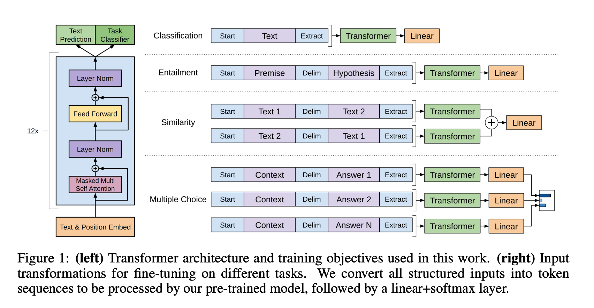

# GPT 系列

> **论文**：[GPT-1](https://cdn.openai.com/research-covers/language-unsupervised/language_understanding_paper.pdf)  [GPT-2](https://cdn.openai.com/better-language-models/language_models_are_unsupervised_multitask_learners.pdf)  [GPT-3](https://arxiv.org/pdf/2005.14165)  [InstructGPT](https://arxiv.org/pdf/2203.02155)  [GPT-4](https://arxiv.org/pdf/2303.08774)
>
> **代码**：[GPT-2](https://github.com/openai/gpt-2)  [GPT-3](https://github.com/openai/gpt-3)

**OpenAI** 是一家致力于推动人工智能前沿研究的公司，在自然语言处理领域取得了重要突破。其 **GPT**（**G**enerative **P**re-trained **T**ransformer）系列模型（如 **GPT-1**、**GPT-2**、**GPT-3**、**ChatGPT**、**GPT-4** 等）持续提升了语言模型的能力与应用范围。**GPT-1** 与 **GPT-2** 奠定了预训练范式基础，**GPT-3** 以 1750 亿参数显著增强了少样本学习能力；**ChatGPT** 在 **GPT-3** 基础上针对对话进行了对齐优化，提升多轮一致性；后续的 **GPT-4** 系列引入更强推理与多模态能力，推动了在文本生成、对话系统与编程辅助等场景的落地。

**GPT** 采用基于 Transformer 的解码器（decoder-only）自回归架构：使用 Masked Multi-Head Self-Attention，仅利用当前位置左侧的上下文来预测下一 token，属于单向语言模型，更适合生成类任务。

## 1. GPT-1

2018 年 6 月，OpenAI 发布 **GPT-1**。其采用基于 Transformer 的解码器（decoder-only）自回归训练。核心思路是：先以无标注文本进行预训练，再在具体 NLP 任务（文本蕴涵、QA、文本分类等）上用少量标注数据进行微调。这一“预训练 + 微调”范式的流程示意如下：

*图 1：GPT-1 训练范式（预训练 + 任务微调）。*

### 1.1 预训练

第一阶段的目标是预训练语言模型，使用 **BooksCorpus** 数据集，包含超过 7000 本来自各种类型的未出版的书籍，它包含了一长段连续的文本，这使得生成模型能够学习长距离信息。另一个数据集是 1B Word Benchmark，与 ELMo 使用方法大致相同，但是在句子层面被打乱了，破坏了长距离结构。在这个语料库中，语言模型达到了 18.4 的非常低的困惑度。

给定一个无监督的 token 语料：$\mathcal{U} = \{u_1, \ldots, u_n\}$，使用标准的语言建模目标来最大化以下似然值：

$$L_1(\mathcal{U}) = \sum_i \log P(u_i | u_{i-k}, \ldots, u_{i-1}; \Theta)$$

上述目标表示在长度为 \(k\) 的左侧上下文条件下，对下一 token 的条件对数似然求和并最大化，即典型的“下一个词预测”训练。

其中$k$是上下文窗口的大小，条件概率$P$通过具有参数$\Theta$的神经网络进行建模。这些参数使用随机梯度下降法进行训练。**GPT-1** 中使用多层 Transformer 解码器，即 **Multi-Head Self-Attention**，并在之后增加前馈网络层，最后输出一个分布：

$$h_0 = U W_e + W_p \\ 
h_l = \text{Transformer\_block}(h_{l-1}),  \forall l \in [1, n] \\
P(u) = \text{Softmax}(h_n W_e^\top)$$

其中 \(h_0\) 为词向量与位置向量相加后的输入表示；多层 Transformer 块递归映射得到 \(h_n\)，再通过共享词嵌入矩阵 \(W_e\) 映射到词表空间并经 softmax 得到下一 token 概率分布。

其中$U = (u_{-k}, \ldots, u_{-1})$是 token 的上下文向量，$n$是层数，$W_e$是 token 嵌入矩阵，$W_p$是位置嵌入矩阵。

训练配置遵循原始 Transformer 设定：仅解码器的 12 层 Transformer，带掩码自注意力；隐藏维度为 768，注意力头数为 12，前馈层隐藏维度为 3072。优化使用 Adam，最大学习率 2.5e-4；前 2000 步线性 warmup，随后余弦退火降至 0。批量大小 64，训练 100 个 epoch，序列长度 512。全模型使用层归一化，权重初始化为 $N(0, 0.02)$。分词采用 **BPE**（词表约 40,000），dropout 比例 0.1；采用改进的 L2 正则（非偏置/增益权重系数 $w=0.01$）。激活函数为 **GELU**，位置编码为可学习参数。文本清洗使用 **ftfy**，并配合 spaCy 分词。

训练时通过准确率来评价训练何时停止：训练的时候生成的文本和原文本进行比对，得到准确率，通过准确率是否达到预期值或是准确率是否一直上下波动等来确定是否该停止训练。

### 1.2 微调

有了预训练的语言模型之后，对于有标签的训练集$\mathcal{C}$ ，给定输入序列$x^1, \cdots, x^m$和标签$y$，可以通过模型得到$h_l^m$，经过输出层后对$y$进行预测：

$$P(y | x^1, \cdots, x^m) = \text{softmax}(h_l^m W_y)$$

其中 \(h_l^m\) 表示序列末 token 在第 \(l\) 层的隐表示，乘以可学习矩阵 \(W_y\) 后经 softmax 映射到标签空间，得到各类别概率。

则目标函数为：

$$L_2(\mathcal{C}) = \sum_{(x, y)} \log P(y | x^1, \ldots, x^m)$$

这是标准的监督学习目标（交叉熵最大化/负对数似然最小化），在给定标注 \(y\) 的条件下优化判别头。

**GPT-1** 发现将语言模型去作为辅助对象来参与微调可以帮助提升监督模型的泛化性能及加速收敛。并且使用这个辅助目标函数可以提升性能，因此使用如下目标函数来进行优化：

$$L_3(\mathcal{C}) = L_2(\mathcal{C}) + \lambda * L_1(\mathcal{C})$$

其中 \(\lambda\) 为权重超参数，\(L_1(\mathcal{C})\) 将同一批有标注样本视作无监督序列计算语言建模损失，作为辅助项可缓解过拟合并保留通用语言表征。

对于不同 NLP 任务的微调过程：

> 1. **分类**：输入为原始文本；取序列末 token 表示作为分类器输入，输出目标类别。
>
> 2. **自然语言推理（NLI）**：输入为“先验 [SEP] 假设”；取末 token 表示作为输入，输出二分类：是否成立（entailment/contradiction）。
>
> 3. **相似性**：构造“句子A [SEP] 句子B”与“句子B [SEP] 句子A”两序列；分别取末 token 表示并相加，经线性层得到二分类：是否相似。
>
> 4. **问答（多选）**：输入为“上下文 [SEP] 问题 [SEP] 答案候选i”；对每个候选取末 token 表示，经共享线性层打分，跨候选做 softmax，选最大者。

微调时在分类器中加入了 dropout，drop 比率设为 0.1。对于大多数任务采用的学习率为 6.25e-5，批量大小为32，大多数情况下 3 个 epoch 的训练就可以。使用线性的学习率衰减调度，并在训练的前 0.2% 进行 warmup。参数$λ=0.5$。

通过训练，**GPT-1** 在多个 NLP 任务上展示了强大的性能。在有监督学习的 12 个基准任务中，**GPT-1** 在 9 个任务上的表现超过了当时的最佳模型。在 Zero-shot 任务中，**GPT-1** 也显示出较好的稳定性，并且随着训练次数的增加，性能逐渐提升。这表明 **GPT-1** 具有较强的泛化能力，可以应用于与训练任务不直接相关的其他 NLP 任务中。虽然 **GPT-1** 在未经微调的任务上虽然也有一定的效果，但其性能通常低于经过微调的有监督任务。这说明 **GPT-1** 在语言建模方面取得了显著进展，但仍需要在特定任务上进行微调才能充分发挥其潜力。因此，**GPT-1** 可以被视为一个强大的领域专家，但还不是一个通用的语言学家。

### 1.3 总结

**GPT-1** 是 OpenAI 于 2018 年提出的首个生成式预训练语言模型，采用基于 **Transformer** 的解码器自回归架构。其以大规模未标注语料进行预训练，再在下游任务上进行少量有监督微调，实现跨任务迁移并显著提升泛化能力。

**优点**

* **预训练 + 微调范式**：两阶段训练显著提升多任务表现与样本效率。
* **Transformer 自注意力**：更好建模长程依赖与上下文信息。
* **迁移适配能力**：少量标注即可适配多类下游任务。

**缺点**
* **单向建模限制**：仅利用左侧上下文，缺乏双向语义整合。
* **模型规模受限**：约 1.17 亿参数，容量有限，复杂语言现象建模受约束。
* **任务级微调依赖**：泛化到具体任务仍需微调，增加部署与维护成本。

## 2 GPT-2

**GPT-2** 的核心思想就是，当模型的容量非常大且数据量足够丰富时，仅仅靠语言模型的学习便可以完成其他有监督学习的任务，不需要在下游任务微调。**GPT-2** 依然沿用 **GPT-1** 单向 Transformer 的模式，只不过使用了更多的网络参数和更大的数据集，以此来训练一个泛化能力更强的词向量模型。

**GPT-2** 相比 **GPT-1** 的主要变化：

> 1. **使用 Zero-shot**，而 **GPT-1** 为预训练和微调
> 2. **字典更大**：同样使用了使用字节对编码构建字典，但字典大小从 40000 增加到 50257
> 3. **模型更大**：将 Transformer 堆叠层数增加到 48 层，隐层的维度增至 1600，参数量达到了 15 亿，而 **GPT-1** 只有 1 亿。
> 4. **数据集更大**：**GPT-2** 的文章取自于 Reddit 上高赞的文章，命名为 WebText。数据集共有约 800 万篇文章，累计体积约 40G。为了避免和测试集的冲突，WebText 移除了涉及 Wikipedia 的文章。而 **GPT-1** 只有 5GB。
> 5. **训练参数变化**：batch\_size 从 64 增加到 512，上文窗口大小从 512 增加到 1024

### 2.1 提示范式：Zero-shot / One-shot / Few-shot

- Zero-shot：仅提供任务描述与提示词，不给示例；模型基于预训练知识完成任务
- One-shot：在任务描述后提供 1 个示例，再给出待求解输入
- Few-shot：在任务描述后提供若干示例（通常 2-32），再给出待求解输入

上述范式通过在上下文中“示范任务格式与映射关系”，使模型在不更新参数的情况下完成迁移。

对于模型来说，**GPT-2** 去掉了 fine-tuning 层，因为不再针对不同任务分别进行微调建模，而是不定义这个模型应该做什么任务，模型会自动识别出来需要做什么任务。fine-tuning 去掉后，引入大量的训练文本，效果就非常好，这也说明只要训练文本够大，网络够大，模型是可以自己根据输入内容判断需要做的任务是什么的。当然 **GPT-2** 的输入也会加入提示词 prompt。并且将 Layer Normalization 放到每个 sub-block 之前，即为了降低训练难度将 post-norm 改成了 pre-norm，并在最后一个 Self Attention 后再增加一个 Layer Normalization。将残差层的初始化值用$\frac{1}{\sqrt{N}}$进行缩放，其中$N$是残差层的个数。

> **注**：**GPT-2** 认为，当一个语言模型的容量足够大时，它就足以覆盖所有的有监督任务，也就是说所有的有监督学习都是无监督语言模型的一个子集。例如当模型训练&#x5B8C;**`Micheal Jordan is the best basketball player in the history`**&#x8BED;料的语言模型之后，便也学会&#x4E86;**`question: "who is the best basketball player in the history ?"，answer: "Micheal Jordan"`**&#x7684; Q\&A 任务。**GPT-2** 的核心思想概括为：任何有监督任务都是语言模型的一个子集，当模型的容量非常大且数据量足够丰富时，仅仅靠训练语言模型的学习便可以完成其他有监督学习的任务。

通过训练，**GPT-2** 达到了不错的效果：

> 1. 在 8 个语言模型任务中，仅仅通过 Zero-shot 学习，**GPT-2** 就有 7 个超过了当时的 SOTA 方法
>
> 2. &#x5728;**`Children's Book Test`**&#x6570;据集上的命名实体识别任务中，**GPT-2** 超过了当时的 SOTA 方法约7%
>
> 3. **`LAMBADA`**&#x662F;测试模型捕捉长期依赖的能力的数据集，**GPT-2** 将困惑度从 99.8 降到了 8.6
>
> 4. 在阅读理解数据中，**GPT-2** 超过了 4 个 baseline 模型中的三个
>
> 5. 在法译英任务中，**GPT-2** 在 Zero-shot 学习的基础上，超过了大多数的无监督方法，但是比有监督的 SOTA 模型要差
>
> 6. **GPT-2** 在文本总结的表现不理想，但是它的效果也和有监督的模型非常接近

### 2.2 总结

**GPT-2** 是 OpenAI 于 2019 年发布的基于 Transformer 架构的大型语言模型，拥有约 15 亿参数，在约 800 万网页的数据集上进行训练。该模型能够生成连贯的文本段落，在许多语言建模基准上取得了最先进的表现。从实用性的角度上，**GPT-2** 并没有带来很大的突破，很多情况下效果与 **BERT** 持平，但是 Zero-shot 的训练方式，有效证明了 NLP 领域训练出一个完全通用模型的可行性，这一刻开始，LLM 走 AIGC 的路初见萌芽，因为整个训练流程看起来就像是模型自主学习知识。

**优点**

**强大的生成能力**：**GPT-2** 在生成文本方面具有出色的能力，可以生成连贯、流畅的文章、故事甚至代码片段。&#x20;

**上下文理解**：该模型通过学习大量的文本数据，能够理解上下文并生成具有逻辑关联性的回复。&#x20;

**多领域应用**：**GPT-2** 对于多个领域的任务都具有良好的适用性，包括机器翻译、摘要生成、对话系统等。&#x20;

**缺点**

**可能生成不当内容**：由于训练数据来自互联网，**GPT-2** 可能生成包含偏见或不适当的内容。

**计算资源需求高**：模型规模较大，训练和推理过程需要大量的计算资源。

**缺乏常识推理**：在处理需要常识推理的任务时，**GPT-2** 的表现可能不尽如人意。

## 3 GPT-3

**Zero-shot** 的方式被 **GPT-2** 认证可行后，OpenAI 就不得不开始考虑模型是否能真正做到强大了，毕竟现在只是和 **BERT&#x20;**&#x6301;平而已。这一刻 OpenAI 开始思考将 LLM 一路走到底，既然模型之大避免不了，那不如来得更彻底一些。**GPT-3** 沿用了做通用模型的思路，把模型做大，达到 175B 参数，同时模型进行升级，使用 **Sparse Transformer**。

**GPT-3** 可以通过少量的样本进行学习，被称为 **`Few-Shot Learner`**。关键点：通过在输入上下文中提供少量示例即可迁移任务，无需再做参数微调。

* **上下文学习**（提示：在输入中呈现“任务—示例—待求解”，实现免微调迁移）

**GPT-3** 的出色性能在很大程度上归功于其采用的 **In-context Learning** 方法。为了理解 **In-context Learning**，先来探讨一下元学习 Meta-learning 的概念。元学习的核心思想是通过学习如何学习，来找到一种有效的学习策略或初始化参数，使得模型能够在新的、未见过的任务上快速适应并取得良好的性能。

**In-context Learning** 是元学习思想的一种具体实现，它允许模型在给定一些示例的情况下，直接通过这些示例来学习并完成任务，而无需显式地更新模型参数。在 **GPT-3** 中，这种学习方式被应用于各种 NLP 任务中。具体来说，当给定一个新的任务时，可以向 **GPT-3** 提供少量的示例输入和对应的输出，&#x5373;**`上下文`**，然后让 **GPT-3** 根据这些示例来推断并生成针对新输入的输出。通过这种方式，**GPT-3** 能够在不依赖大量有标签训练数据的情况下，快速适应并完成各种 NLP 任务。

**GPT-3&#x20;**&#x7684; **In-context Learning** 能力得益于其巨大的参数量和训练数据集。通过在大规模无监督文本数据上进行预训练，**GPT-3&#x20;**&#x5DF2;经学习到了丰富的语言知识和模式。这使得它能够在给定少量示例的情况下，快速理解并应用这些知识来完成新任务。同时，**GPT-3** 的巨大参数量也使其具备了强大的表征能力，能够捕捉并表达复杂的语言现象和语义关系。

* **稀疏注意力**（提示：用稀疏连接降低注意力计算复杂度，支持更长上下文）

> https://arxiv.org/pdf/1904.10509

模型结构上，**GPT-3&#x20;**&#x548C; **GPT-1，GPT-2&#x20;**&#x7684;区别主要在于使用了稀疏的自注意力：

**常规自注意力**

在上图中，左边是注意力矩阵，右边显示了关联性，即每个元素都跟序列内所有元素有关联。因为它要对序列中的任意两个向量都要计算相关度，得到一个$n^2$大小的相关度矩阵。从理论上来讲，Self Attention 的计算时间和显存占用量都是$O(n^2)$级别的，$n$是序列长度。

**膨胀自注意力**

启发于膨胀卷积，它对相关性进行了约束，要求每个元素只跟它相对距离为$k,2k,3k,\cdots$的元素关联，其中$k>1$是预先设定的超参数。因此每个元素只跟$\frac{n}{k}$个元素算相关性，这样理想情况下运行效率和显存占用都变成了$O(\frac{n^2}{k})$，即直接降低到原来的$\frac{1}{k}$。

**局部自注意力**

引入局部关联，约束每个元素只与前后$k$个元素以及自身有关联，保留了一个$2k+1$大小的窗口，然后在窗口内进行运算，即每个元素只跟$2k+1$个元素算相关性，这样一来理想情况下运行效率和显存占用都变成了$O((2k+1)n)∼O(kn)$了，也就是说随着$n$线性增长，这是很理想的性质，也直接牺牲了长程关联性。

**稀疏自注意力**

直接将膨胀自注意力和局部自注意力合并为一个，从注意力矩阵上看就是除了相对距离不超过$k$的、相对距离为$k,2k,3k,\cdots$的注意力都设为$0$，这样注意力就具&#x6709;**`局部紧密相关`**&#x548C;**`远程稀疏相关`**&#x7684;特性，这对很多任务来说可能是一个不错的先验，因为真正需要密集的长程关联的任务事实上是很少的。

使用稀疏自注意力的好处：减少注意力层的计算复杂度，节约显存和耗时，从而能够处理更长的输入序列；具有**局部紧密相关**和**远程稀疏相关**的特性，对于距离较近的上下文关注更多，对于距离较远的上下文关注较少。但是缺点是 NLP 中语言内容都是有上下文关系的，如此依赖必定会对长文本建模的效果变差。

* **预训练**

**GPT-3** 的预训练方法，包括模型、数据和训练过程，类似于 **GPT-2**，但是扩大了模型大小、数据集大小和多样性以及训练长度。即：

> 1. 采用了 **96** 层的多头自注意力，头的个数&#x4E3A;**&#x20;96**
>
> 2. 词向量的长度是 **12888**
>
> 3. 上下文划窗的窗口大小提升至 **2048** 个

总参数量达到了 1750亿，上下文学习方法也类似于 **GPT-2**，但系统地探索了不同的上下文学习设置。

**GPT-3** 的训练数据包括低质量的从 CommonCrawl 分片中下载的 **C4**，压缩后的纯文本大小为 45TB，过滤后为570GB，相当于大约 4000 亿个字节对编码的 token；高质量的 WebText2，两个基于互联网的书籍语料库Books1、Books2 和英文维基百科 Wikipedia。其中未经过滤的 Common Crawl 版本质量较低，因此采取了三个步骤提高数据集质量：1. 下载并根据与一系列高质量参考语料库的相似性筛选了一个版本的 Common Crawl；2. 在文档级别执行了模糊去重，既包括数据集内部也跨越不同数据集之间，以防止冗余并保持我们保留验证集的完整性，作为过度拟合的一个准确衡量标准；3. 添加了已知的高质量参考语料库到训练组合中，以增强Common Crawl并增加其多样性。

**GPT-3** 根据数据集的不同的质量赋予了不同的权值，权值越高的在训练的时候越容易抽样到。训练语料的 60% 来自于 C4，22% 来自于 WebText2，16% 来自于 Books，3%来自于 Wikipedia。

训练时，使用了 31 个分工明确的作者，超强算力的计算机（285,000 个 CPU， 10,000 个 GPU），1200 万的训练费用，45TB 的训练数据。通过实验发现：模型越大，测试案例数量越多，最终效果越好。当测试案例很多时，Prompt 变得不那么重要，因为从案例中也可以推断出任务类型。大型模型的更陡峭的上下文学习曲线表明从上下文信息中学习任务的能力有所提高，模型越大，上下文信息的使用效率就越高。

总体来看，在所有 Zero-shot，One-shot 和 Few-shot 三种情况下，对于大多数任务，作者发现模型容量与性能之间存在相对平滑的关系；一个值得注意的模式是，Zero-shot，One-shot 和 Few-shot 的性能差距通常随着模型容量的增加而增大，这可能表明更大的模型更擅长元学习。&#x20;

### 3.1 总结

**GPT-3** 是 OpenAI 于 2020 年发布的自回归语言模型，拥有1750亿个参数，是当时参数规模最大的非稀疏语言模型。该模型在大规模文本数据上进行预训练，能够执行多种自然语言处理任务，如语言翻译、问答和自动文本摘要。

**优点**

**强大的语言生成能力**：GPT-3能够生成连贯且富有创意的文本，适用于写作辅助、内容创作等领域。&#x20;

**少样本学习能力**：在提供少量示例的情况下，GPT-3可以执行特定任务，展示了出色的few-shot学习能力。&#x20;

**广泛的应用场景**：GPT-3可用于文本分类、情感分析、代码生成等多种自然语言处理任务。

**缺点**

**计算资源需求高**：由于模型参数庞大，训练和部署GPT-3需要大量的计算资源和存储空间。&#x20;

**可能生成不当内容**：GPT-3可能生成包含偏见或不适当的内容，反映了训练数据中的偏见。&#x20;

**缺乏常识推理能力**：在处理需要常识推理的任务时，GPT-3的表现可能不尽如人意。&#x20;

### 4. GPT-3.5

**GPT-3** 表现出了强大的零样本理解能力，但在对话方面表现不佳，主要存在以下问题：① 缺少正向价值观，回答不够圆滑；② 回答风格与人类预期有偏差；③ 编造事实。

以上缺点根本原因&#x662F;**&#x20;GPT** 是一个语言模型，它在大规模语料上熟练掌握了各种语法规则、知识网络，但它对人类的偏好不太了解，因此生成的答案不尽人意。这就需要继续训练，让它能够更偏向生成让人满意的答案。继续训练就需要人工标注大量的问答对，完全靠人工标注不现实，那么就需要借助强化学习的方式让它自我学习。

* **强化学习**

强化学习主要应用在游戏领域，一般是用机器控制一方，与对手博弈。以回合制游戏为例，每个轮次机器走一步，对手走一步，游戏进入下一状态，如此重复，直到系统判定游戏结束，其中一方获胜。我们一般把机器看成一个策略函数$\pi$，它通过当前状态$s_t$，预估下一步所有动作$a$的概率，然后以预估的概率随意抽取其中一个动作$a_t$执行，对手紧接着做出决策，游戏进入下一个状态$s_{t+1}$。

这个过程一般以两个指标评价这一步动作的价值：

1. $r_t$当前这一步的价值，有些游戏每一步后立刻会给出奖励，有的游戏需要玩完本局才能确定。

2. $u_t$当前这一步从全局看的价值，$u_t=r_t+\lambda*r_{t+1}+\lambda^2*r_{t+2}+\cdots$.

以策略函数$\pi(a_t|s_t;\theta)$为学习目标的学习方法被称为策略强化学习。学习过程如下：

> 1. 玩游戏，收集训练数据$(s_t,a_t,u_t), a_t$是由$\pi$采样得到，$u_t$是系统给出的反馈
>
> 2. 在收集的训练数据上，基于目标函数，使用梯度上升（或下降）更新$\pi$
>
> 3. 重复以上 **1**, **2** 步，直到达到结束条件

从上可以看出，强化学习是不需要人工标数据的，策略函数一边收集训练数据，一边迭代自己。之所以不需要人工标数据，是因为有一套程序可以自动对动作打分。比如围棋，下到最后，通过程序可以判断哪一方赢了。所以要想用强化学习来训练 **GPT**，得有一个评估答案好坏的程序，显然通过规则没法做到，因此需要先训练一个评估模型 **Reward Model**，然后再通过奖励模型得分来进行强化学习，分为三步：

通过人工标注问答数据，对 **GPT&#x20;**&#x8FDB;行微调，即监督微调 **SFT**（**S**upervised **F**ine-**T**uning）

通过微调后的模型及问题，生成多个答案，人工对答案排序，训练 **RM**（**R**eward **M**odel）

强化学习，以 **RM&#x20;**&#x4E3A;回报函数，使用 **PPO**（**P**roximal **P**olicy **O**ptimization）训练策略模型

* **监督微调 SFT**

SFT 数据集是用来训练第 1 步有监督的模型，即使用采集的新数据，按照 GPT-3 的训练方式对 GPT-3 进行微调。因为 GPT-3 是一个基于提示学习的生成模型，因此 SFT 数据集也是&#x7531;**`提示-答复`**&#x5BF9;组成的样本。SFT 数据一部分来自使用 OpenAI 的 PlayGround 的用户，另一部分来自 OpenAI 雇佣的 40 名标注工。并且他们对标注工进行了培训，在 SFT 阶段共标注 13k &#x7684;**`(prompt, completion)`**&#x5BF9;问答数据。在这个数据集中，标注工的工作是根据内容自己编写指示，并且要求编写的指示满足下面三点：

> 1. **简单任务**：标注工给出任意一个简单的任务，同时要确保任务的多样性
>
> 2. **Few-shot 任务**：标注工给出一个指示，以及该指示的多&#x4E2A;**`查询-响应`**&#x5BF9;
>
> 3. **用户相关的**：从接口中获取用例，然后让标注工根据这些用例编写指示

SFT 使用和 GPT 预训练完全一样的网络结构，训练目标也是似然函数最大化：

$$L(\theta)=\prod \limits_{i=1}^{N}\pi^{SFT}(y_i|x_i;\theta)$$

* **奖励模型 RM**

RM 数据集用来训练第 2 步的奖励模型，当然也需要为 **GPT-3.5** 的训练设置一个奖励目标，要尽可能全面且真实的对齐需要模型生成的内容。这可以通过人工标注的方式来提供这个奖励，通过人工可以给那些涉及偏见的生成内容更低的分从而鼓励模型不去生成这些人类不喜欢的内容。**GPT-3.5** 的做法是先让模型生成一批候选文本，然后通过标注工根据生成数据的质量对这些生成内容进行排序。

具体来说，随机抽取一批问题，SFT 后的模型对每个问题生成$K$个答案（$4\le K\le9$），人工对$K$个答案排序，然后两两回答一组，组成一条训练数据，例&#x5982;**`(prompt, A, B)`**，则一共有$K \choose 2$条训练数据。

在这一阶段，一共有 33k 的标注数据被用于训练。在训练时，对于提示$x$和所有回答$y$将组成一个 batch，通过构造并最小化 **Pairwise Ranking Loss** 的方法，来训练奖励模型。损失函数可以表示为：

$$L(\theta)=-\frac{1}{K \choose 2} E_{(x, y_w, y_l)\sim D} [log(\sigma(r_{\theta}(x, y_w)-r_{\theta}(x, y_l)))]$$

其中$r_{\theta}(x, y)$是奖励模型对提示$x$和回答$y$的标量输出，参数为$\theta$，$y_w$和$y_l$分别表示从$K$个答案中任取两个中的相对好、差答案，$D$表示prompt下人类标注排序的所有两两回答对，$\sigma$表示 sigmoid 函数。

对于训练后的奖励模型，希望当回答$y$的排序相对较高时，$r_\theta(x, y)$的得分也能越高。为了不让$K$的个数影响训练模型，需要在前面乘上$\frac{1}{K \choose 2}$，将 loss 平均到每一个答案对上。在训练时要将$(x, y_w,y_l)\sim D$当成一个 batch 同时送入模型，而不是将单条$(x, y_w,y_l)$数据分别送入模型，因为对于某一对$(x, y_w,y_l)$，用 batch 方式时，它只参与一次梯度计算，而用单条方式时，它需要参与$K-1$次梯度计算，这避免了过拟合的风险。除此之外也可以提升计算效率。在模型前向传播的过程中，最耗时的步骤是计算$r_\theta(x, y)$，用 batch 方式时，该计算只需执行$K$次，因为模型参数没有更新，相同的$(x, y)$可以重复使用，但采用单条方式时，需要计算$K(K-1)$次，因为一条计算更新一次模型，模型参数更新，相同的$(x,y)$需要重新计算。因此，$K$越大时，采用 batch 的方式越划算，因为它在保证相对排序信息丰富的同时，又节省了计算效率。

* **人类反馈强化学习 RLHF**

通过第 2 步得到的奖励模型来指导 SFT 模型的继续训练，让模型能够更好的对齐人类意图。这里 **GPT-3.5** 使用改良版本的 **PPO** 对 GPT 再次训练，但 **GPT-3.5** 的 **PPO** 数据没有进行标注，它均来自 GPT-3 的 API 的用户。其中有不同用户提供的不同种类的生成任务，占比最高的包括生成任务（45.6%），QA（12.4%），头脑风暴（11.2%），对话（8.4%）等。

> **注**：**PPO** 算法是一种新型的 Policy Gradient 算法，Policy Gradient 算法对步长十分敏感，但是又难以选择合适的步长，在训练过程中新旧策略的的变化差异如果过大则不利于学习。**PPO** 提出了新的目标函数可以在多个训练步骤实现小批量的更新，解决了 Policy Gradient 算法中步长难以确定的问题。

强化学习的三要素：**`策略`**、**`动作空间`**&#x548C;**`奖励函数`**。策略就是基于该语言模型，接收 prompt 作为输入，然后输出一系列文本的概率分布；动作空间就是词表所有 token 在所有输出位置的排列组合；奖励函数则是基于训好的 RM 模型计算得到 reward。具体的强化学习目标函数如下：

$$\text{objective}(\phi) = E_{(x, y) \sim D_{\pi_{\phi}^{\text{RL}}}} \left[ r_\theta(x, y) - \beta \log \left( \frac{\pi_{\phi}^{\text{RL}}(y \mid x)}{\pi^{\text{SFT}}(y \mid x)} \right) \right] + \gamma E_{x \sim D_{\text{pretrain}}} \left[ \log \left( \pi_{\phi}^{\text{RL}}(x) \right) \right]$$

其中$\pi_{\phi}^{\mathrm{RL}}$表示我们此刻要学的强化学习模型，又称&#x4E3A;**`策略`** policy，$\pi^{\mathrm{SFT}}$表示在第一步骤中，经过 SFT 的 GPT 模型，初始时，$\pi_{\phi}^{\mathrm{RL}} = \pi^{\mathrm{SFT}}$。$r_\theta$表示第二步骤中的奖励模型。

目的要最大化该损失函数，这里对公式每一项进行详细解释

> 1. $E_{(x, y) \sim D_{\pi_{\phi}^{\mathrm{RL}}}}$，$x$表示某个 prompt，$y$表示把$x$送入当前状态的强化学习模型中所产生的输出
>
> 2. $r_\theta(x, y)$表示当前强化模型下，将$x$和其所产生的$y$送入奖励模型进行打分，这个分数越高越好
>
> 3. $\log (\frac{\pi_{\phi}^{\mathrm{RL}}(y \mid x)}{\pi^{\mathrm{SFT}}(y \mid x)})$表示 KL 散度，用于比较两个模型的输出分布是否相似，KL 值越大，分布越不相似，分布相同时$KL=0$。在本阶段中希望强化学习后得到的 GPT，在能够理解人类意图的基础上，又不要和最原始的 GPT 的输出相差太远，即防止大模型训偏。参数$\beta$则表示对这种偏差的容忍程度，偏离越远，就要从奖励模型的基础上得到越多的惩罚。截止到这一步，称为 PPO
>
> 4. $E_{x \sim D_{\text {prertain }}}$中，$D_{\text {prertain}}$表示在 SFT 之前，最初始的 GPT3 模型，$x$表示来自初始模型产出的数据
>
> 5. $\log \left(\pi_{\phi}^{\mathrm{RL}}(x)\right)$表示将来自初始 GPT 中的数据送入当前强化模型下，同样是希望当前强化模型输出分布不要偏离太多。$\gamma$则是对这种偏离的惩罚程度。添加上这一项以后的优化策略，称为PPO-ptx

**总结**

GPT-3.5 是 OpenAI 在 GPT-3 基础上改进的语言模型，于 2022 年底推出。该模型通过在大规模互联网文本数据上进行预训练，并结合人工标注数据和强化学习，提升了模型的推理和生成能力。GPT-3.5 具备更强的上下文理解和生成连贯文本的能力，在对话系统、内容创作等领域表现出色。

**优点**

**增强的真实性和价值观对齐**：通过引入人工标注，GPT-3.5 的输出在真实性和符合人类价值观方面有显著提升。

**更自然的响应**：得益于 GPT-3 的强大泛化和生成能力，结合人工提示编写和结果排序，GPT-3.5 生成的响应更加自然。

**无害性有所提升**：虽然提升有限，但 GPT-3.5 在减少有害内容生成方面表现出一定改进。

**缺点**

**通用 NLP 任务性能下降**：在特定任务上的优化可能导致模型在其他通用自然语言处理任务上的性能有所下降。

**可能生成荒谬的输出**：尽管引入了人类反馈，GPT-3.5 有时仍会生成不真实或不合理的内容。

**对指令敏感且可能误解简单概念**：模型对输入指令的敏感性较高，可能会对简单概念进行过度解读，导致输出不符合预期。

### 5. GPT-4

**GPT-4** 是 OpenAI 发布的最新 GPT 系列模型。它是一个大规模多模态模型，相&#x6BD4;**&#x20;GPT-3.5**，**GPT-4** 可以接受图像和文本两种形式的输入，产生文本输出。输出依旧是一个自回归的单词预测任务。技术上，**GPT-4** 采用了专家混合技术，进一步增强模型的能力。整体来说，**GPT-4** 在各种专业和学术基准上表现出了人类的水平，对于生成式的幻觉、安全问题均有较大的改善。

* **模型结构**

**GPT-4** 的体系结构由 16 个不同的专家模型组成，每个模型都有 111B 个参数，总计约 1.76 万亿个参数。除了更大的参数规模外，另一个重要的细节是 GPT-4 使用了专家混合 **MoE**（**M**ixture **o**f **E**xperts）架构，这意味着模型中的不同组件协同工作，每个组件都有助于最终输出。在 **GPT-4** 中 Attention 的参数量有 55B，**MoE** 的参数量是 111B \* 16，一共 120 层 Transformer。每个 token 会通过一个路由算法选择两个 MLP 进行计算，参数 seq\_len 为 8k，每个 MLP 分到 1k 个 token。

**GPT-4** 的模型宽度，深度基本和 GPT-3 (175B) 差不多，区别在于 MLP 的数量要多 16 倍。

* **并行策略**

**GPT-4** 训练采用的并行策略是：

> * **张量并行**：8
>
> * **流水并行**：16
>
> * **数据并行**：196

总计使用约 3125 台机器（25000 张 A100）进行训练。其中 batch size 为 60M token，seq\_len 为 8k。

张量并行和流水并行包含了 **GPT-4** 完整的模型参数，其结构如右图所示。其中，张量并行通讯耗时占比小于 15%，PipeDream 流水线气泡占比 28% 左右，Interleaved 1F1B 流水线气泡占比 16% 左右。

**MoE** 模型是一种在模型增强的道路达到极限时采用的实用方法，由多个专家组成，每个专家都精通某个特定领域，然后利用他们的集体智慧，协作以提供增强的结果。如下图所示：

对于 **MoE** 模型进行并行训练，这里做一个初步的估计：按照目前最大的 8 路张量并行，16 路流水线并行计算，每个 GPU 上的参数量是 14B，假设用 FP32 的梯度，则参数和梯度需要占用 84 GB 的显存，目前市面上还没有能完整放下显卡。因此，**GPT-4** 大概率会使用专家并行（Expert Parallelism）技术来节省显存占用。

* **模型能力**

**GPT-4** 做的这些改进效果是显著的，相比前代 **GPT-3.5**，他具备了新的能力：

> 1. **具有图像理解能力**：突破纯文字的模态，增加了图像模态的输入
>
> 2. **支持更长的上下文窗口**：**GPT-4&#x20;**&#x7684; seq\_len 为 8k，&#x662F;**&#x20;GPT-3.5&#x20;**&#x4E0A;下文长度的 2 倍
>
> 3. **复杂任务处理能力大幅提升**：**GPT-4** 在更复杂、更细微的任务处理上，回答更可靠、更有创意
>
> 4. **改善幻觉、安全等局限性**：LLM 的生成模式不可避免会有一些幻觉问题。**GPT-4&#x20;**&#x5728;测试中发现其可以显著减轻在各类任务上幻觉问题，&#x6BD4;**&#x20;GPT-3.5&#x20;**&#x6A21;型提高 40% 左右。同样在安全能力的升级上，**GPT-4** 明显超出 **GPT3.5**

**总结**

**GPT-4** 是否会引发第四次工业革命仍需要时间验证，但其对人工智能领域的影响巨大。它挑战了传统人工智能的认知，展示出超越深度学习传统理解的零样本学习能力和更高阶的推理能力。**GPT-4&#x20;**&#x5DF2;成为日常工作中的得力助手，广泛应用于代码编写、文章修改以及解决非工作相关问题。此外，随着多种大模型的出现，深度学习领域重新焕发了活力。

未来，GPT-4 预预计将在多个方面产生深远影响：首先，互联网上将涌现大量 **GPT-4&#x20;**&#x751F;成的内容，需要警惕其对大众行为模式的潜在影响；其次，**GPT-4&#x20;**&#x5C06;在提高某些工作生产力的同时，也有可能替代一些工作岗位，为社会带来新的机会；最后，**GPT-4&#x20;**&#x5982;何影响个体将因人而异，但若它助推了 AGI 的发展，将为科技进步带来前所未有的机遇。

**优点**

**更强的推理能力**：**GPT-4** 相比于前代模型，在推理、理解复杂上下文、解决多轮对话等方面有显著提升。它能够处理更为复杂的问题，并生成更精确的回答。

**多模态支持**：**GPT-4** 支持多模态输入（文本和图像），使其能够理解和生成多种类型的数据，拓展了应用场景。例如，可以处理图像描述、图文结合的问答等任务。

**更好的知识整合与准确性**：**GPT-4** 在处理事实性问题时，比 **GPT-3** 和 **GPT-3.5** 更加准确，减少了虚假信息的生成。它能够更好地整合从多个来源获得的知识。

**缺点**

**计算资源消耗大**：**GPT-4** 的模型规模非常庞大，训练和部署所需的计算资源和存储空间远高于前代模型。这对研究和开发来说是一个挑战。

**仍存在偏见和有害输出**：虽然 **GPT-4** 在减少有害内容方面做出了改进，但它仍然可能生成带有偏见、不适当或有害的输出。这种问题在多模态生成中尤为复杂。

**推理仍有限**：虽然 **GPT-4** 提升了推理能力，但在面对复杂的推理问题时，它仍然可能出现错误，尤其是在缺乏足够上下文或知识的情况下。这使得它在某些情况下的可靠性较低。

### 6. GPT-4o

### 7. GPT-4.5

### 8. OpenAI o1

### 9. OpenAI o3 & o4

### 10. GPT-OSS